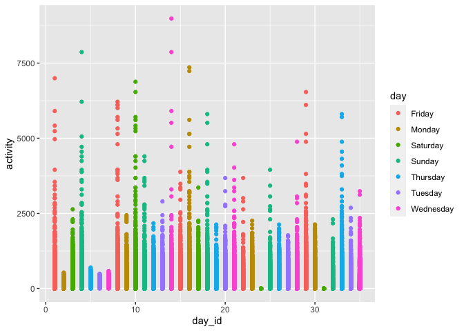

p8105_hw3_ew2718
================
Emma Warshaw
2022-10-11

``` r
library(tidyverse)
```

    ## ── Attaching packages ─────────────────────────────────────── tidyverse 1.3.2 ──
    ## ✔ ggplot2 3.3.6      ✔ purrr   0.3.4 
    ## ✔ tibble  3.1.8      ✔ dplyr   1.0.10
    ## ✔ tidyr   1.2.0      ✔ stringr 1.4.1 
    ## ✔ readr   2.1.2      ✔ forcats 0.5.2 
    ## ── Conflicts ────────────────────────────────────────── tidyverse_conflicts() ──
    ## ✖ dplyr::filter() masks stats::filter()
    ## ✖ dplyr::lag()    masks stats::lag()

``` r
library(knitr)
```

**Problem 1** This problem uses the Instacart data. DO NOT include this
dataset in your local data directory; instead, load the data from the
p8105.datasets using:

``` r
library(p8105.datasets)
data("instacart")
```

\#The goal is to do some exploration of this dataset. To that end, write
a short description of the dataset, noting the size and structure of the
data, describing some key variables, and giving illstrative examples of
observations. Then, do or answer the following (commenting on the
results of each):

This is a very large dataset: there are 1,384,617 observations for a
total of 15 variables. The variables include: order id, product id, add
to cart order, user id, evaluation set, the order number, order_dow,
order hour of the day, days since prior order, product name, aisle id,
department id, aisle, and department. Variables are a mix of numberic
and character variables.

\#How many aisles are there, and which aisles are the most items ordered
from? There are 134 aisles total. Aisle 3 has 17,449 observations.

``` r
#instacart %>% 
  #group_by(aisle_id) %>%
  #summarize(n_obs = n())
```

\#Make a plot that shows the number of items ordered in each aisle,
limiting this to aisles with more than 10000 items ordered. Arrange
aisles sensibly, and organize your plot so others can read it.

``` r
#ggplot(instacart, aes(x = aisle_id)) + 
  #geom_histogram() %>%
  #ifelse(instacart >= 10000 )
```

Make a table showing the three most popular items in each of the aisles
“baking ingredients”, “dog food care”, and “packaged vegetables fruits”.
Include the number of times each item is ordered in your table.

Make a table showing the mean hour of the day at which Pink Lady Apples
and Coffee Ice Cream are ordered on each day of the week; format this
table for human readers (i.e. produce a 2 x 7 table).

**Problem 2** This problem uses five weeks of accelerometer data
collected on a 63 year-old male with BMI 25, who was admitted to the
Advanced Cardiac Care Center of Columbia University Medical Center and
diagnosed with congestive heart failure (CHF). The data can be
downloaded here. In this spreadsheet, variables activity.\* are the
activity counts for each minute of a 24-hour day starting at midnight.

\#Load, tidy, and otherwise wrangle the data. Your final dataset should
include all originally observed variables and values; have useful
variable names; include a weekday vs weekend variable; and encode data
with reasonable variable classes. Describe the resulting dataset
(e.g. what variables exist, how many observations, etc).

``` r
accelerometer = read_csv("./data/accel_data.csv") %>%
  janitor::clean_names() %>%
  pivot_longer(activity_1:activity_1440,
               names_to = "minute",
               values_to = "activity") %>%
  mutate(day_type = case_when(
    day == 'Monday' ~ 'weekday',
    day == 'Tuesday' ~ 'weekday',
    day == 'Wednesday' ~ 'weekday',
    day == 'Thursday' ~ 'weekday',
    day == 'Friday' ~ 'weekday',
    day == 'Saturday' ~ 'weekend',
    day == 'Sunday' ~ 'weekend'
  )) %>% 
  select(day_type, everything())
```

    ## Rows: 35 Columns: 1443
    ## ── Column specification ────────────────────────────────────────────────────────
    ## Delimiter: ","
    ## chr    (1): day
    ## dbl (1442): week, day_id, activity.1, activity.2, activity.3, activity.4, ac...
    ## 
    ## ℹ Use `spec()` to retrieve the full column specification for this data.
    ## ℹ Specify the column types or set `show_col_types = FALSE` to quiet this message.

\#Traditional analyses of accelerometer data focus on the total activity
over the day. Using your tidied dataset, aggregate across minutes to
create a total activity variable for each day, and create a table
showing these totals. Are any trends apparent?

The last two Saturdays of the time period (ID=24 & 31) have extremely
low activity scores. In fact, the last two weekends have much lower
activity scores than the previous two weekends.

``` r
accelerometer %>%
  group_by(day_id) %>%
  summarise(activity_total = sum(activity)) %>%
  kable()
```

| day_id | activity_total |
|-------:|---------------:|
|      1 |      480542.62 |
|      2 |       78828.07 |
|      3 |      376254.00 |
|      4 |      631105.00 |
|      5 |      355923.64 |
|      6 |      307094.24 |
|      7 |      340115.01 |
|      8 |      568839.00 |
|      9 |      295431.00 |
|     10 |      607175.00 |
|     11 |      422018.00 |
|     12 |      474048.00 |
|     13 |      423245.00 |
|     14 |      440962.00 |
|     15 |      467420.00 |
|     16 |      685910.00 |
|     17 |      382928.00 |
|     18 |      467052.00 |
|     19 |      371230.00 |
|     20 |      381507.00 |
|     21 |      468869.00 |
|     22 |      154049.00 |
|     23 |      409450.00 |
|     24 |        1440.00 |
|     25 |      260617.00 |
|     26 |      340291.00 |
|     27 |      319568.00 |
|     28 |      434460.00 |
|     29 |      620860.00 |
|     30 |      389080.00 |
|     31 |        1440.00 |
|     32 |      138421.00 |
|     33 |      549658.00 |
|     34 |      367824.00 |
|     35 |      445366.00 |

\#Accelerometer data allows the inspection activity over the course of
the day. Make a single-panel plot that shows the 24-hour activity time
courses for each day and use color to indicate day of the week. Describe
in words any patterns or conclusions you can make based on this graph.

``` r
accelerometer %>%
  ggplot(aes(x = day_id, y = activity)) + geom_point(aes(color = day))
```

<!-- -->
